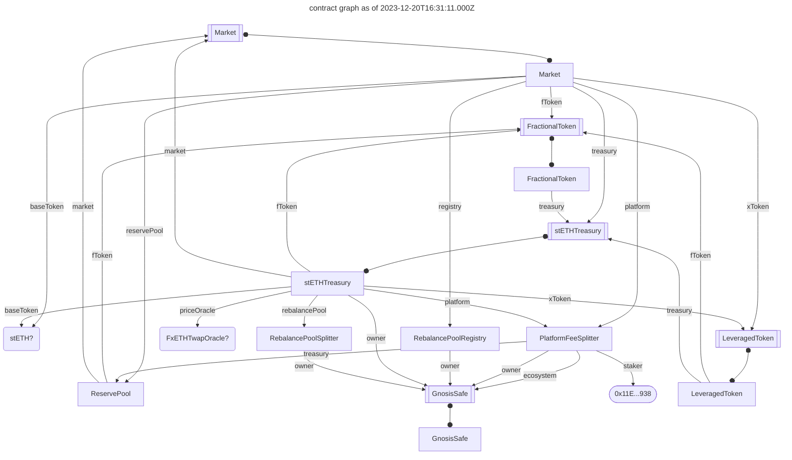

```mermaid
---
title: contract graph as of 2023-12-20T16:31:11.000Z
---
flowchart TB

0xe7b9c7c9cA85340b8c06fb805f7775e3015108dB[[Market]]:::contract
click 0xe7b9c7c9cA85340b8c06fb805f7775e3015108dB "https://etherscan.io/address/0xe7b9c7c9cA85340b8c06fb805f7775e3015108dB#code"
0x679de4a3836d916fc86c6d9944c98a694f68adb4[Market]:::contract
click 0x679de4a3836d916fc86c6d9944c98a694f68adb4 "https://etherscan.io/address/0x679de4a3836d916fc86c6d9944c98a694f68adb4#code"
0xe7b9c7c9cA85340b8c06fb805f7775e3015108dB o--o 0x679de4a3836d916fc86c6d9944c98a694f68adb4

0x679de4a3836d916fc86c6d9944c98a694f68adb4 -- baseToken --> 0xae7ab96520DE3A18E5e111B5EaAb095312D7fE84

0x679de4a3836d916fc86c6d9944c98a694f68adb4 -- fToken --> 0x53805A76E1f5ebbFE7115F16f9c87C2f7e633726

0x679de4a3836d916fc86c6d9944c98a694f68adb4 -- platform --> 0x0084C2e1B1823564e597Ff4848a88D61ac63D703

0x679de4a3836d916fc86c6d9944c98a694f68adb4 -- registry --> 0x4eEfea49e4D876599765d5375cF7314cD14C9d38

0x679de4a3836d916fc86c6d9944c98a694f68adb4 -- reservePool --> 0x5d0Aacf75116d1645Db2B3d1Ca4b303ef0CA3752

0x679de4a3836d916fc86c6d9944c98a694f68adb4 -- treasury --> 0x0e5CAA5c889Bdf053c9A76395f62267E653AFbb0

0x679de4a3836d916fc86c6d9944c98a694f68adb4 -- xToken --> 0xe063F04f280c60aECa68b38341C2eEcBeC703ae2

0xae7ab96520DE3A18E5e111B5EaAb095312D7fE84(stETH?):::address
click 0xae7ab96520DE3A18E5e111B5EaAb095312D7fE84 "https://etherscan.io/address/0xae7ab96520DE3A18E5e111B5EaAb095312D7fE84"

0x53805A76E1f5ebbFE7115F16f9c87C2f7e633726[[FractionalToken]]:::contract
click 0x53805A76E1f5ebbFE7115F16f9c87C2f7e633726 "https://etherscan.io/address/0x53805A76E1f5ebbFE7115F16f9c87C2f7e633726#code"
0x2a906eab9b088e6753670bc8d3840f9473745748[FractionalToken]:::contract
click 0x2a906eab9b088e6753670bc8d3840f9473745748 "https://etherscan.io/address/0x2a906eab9b088e6753670bc8d3840f9473745748#code"
0x53805A76E1f5ebbFE7115F16f9c87C2f7e633726 o--o 0x2a906eab9b088e6753670bc8d3840f9473745748

0x2a906eab9b088e6753670bc8d3840f9473745748 -- treasury --> 0x0e5CAA5c889Bdf053c9A76395f62267E653AFbb0

0x0084C2e1B1823564e597Ff4848a88D61ac63D703[PlatformFeeSplitter]:::contract
click 0x0084C2e1B1823564e597Ff4848a88D61ac63D703 "https://etherscan.io/address/0x0084C2e1B1823564e597Ff4848a88D61ac63D703#code"

0x0084C2e1B1823564e597Ff4848a88D61ac63D703 -- ecosystem --> 0x26B2ec4E02ebe2F54583af25b647b1D619e67BbF

0x0084C2e1B1823564e597Ff4848a88D61ac63D703 -- owner --> 0x26B2ec4E02ebe2F54583af25b647b1D619e67BbF

0x0084C2e1B1823564e597Ff4848a88D61ac63D703 -- staker --> 0x11E91BB6d1334585AA37D8F4fde3932C7960B938

0x0084C2e1B1823564e597Ff4848a88D61ac63D703 -- treasury --> 0x5d0Aacf75116d1645Db2B3d1Ca4b303ef0CA3752

0x4eEfea49e4D876599765d5375cF7314cD14C9d38[RebalancePoolRegistry]:::contract
click 0x4eEfea49e4D876599765d5375cF7314cD14C9d38 "https://etherscan.io/address/0x4eEfea49e4D876599765d5375cF7314cD14C9d38#code"

0x4eEfea49e4D876599765d5375cF7314cD14C9d38 -- owner --> 0x26B2ec4E02ebe2F54583af25b647b1D619e67BbF

0x5d0Aacf75116d1645Db2B3d1Ca4b303ef0CA3752[ReservePool]:::contract
click 0x5d0Aacf75116d1645Db2B3d1Ca4b303ef0CA3752 "https://etherscan.io/address/0x5d0Aacf75116d1645Db2B3d1Ca4b303ef0CA3752#code"

0x5d0Aacf75116d1645Db2B3d1Ca4b303ef0CA3752 -- fToken --> 0x53805A76E1f5ebbFE7115F16f9c87C2f7e633726

0x5d0Aacf75116d1645Db2B3d1Ca4b303ef0CA3752 -- market --> 0xe7b9c7c9cA85340b8c06fb805f7775e3015108dB

0x0e5CAA5c889Bdf053c9A76395f62267E653AFbb0[[stETHTreasury]]:::contract
click 0x0e5CAA5c889Bdf053c9A76395f62267E653AFbb0 "https://etherscan.io/address/0x0e5CAA5c889Bdf053c9A76395f62267E653AFbb0#code"
0x969fcabb703052155c4cc3b24458e77b2d56b29a[stETHTreasury]:::contract
click 0x969fcabb703052155c4cc3b24458e77b2d56b29a "https://etherscan.io/address/0x969fcabb703052155c4cc3b24458e77b2d56b29a#code"
0x0e5CAA5c889Bdf053c9A76395f62267E653AFbb0 o--o 0x969fcabb703052155c4cc3b24458e77b2d56b29a

0x969fcabb703052155c4cc3b24458e77b2d56b29a -- baseToken --> 0xae7ab96520DE3A18E5e111B5EaAb095312D7fE84

0x969fcabb703052155c4cc3b24458e77b2d56b29a -- fToken --> 0x53805A76E1f5ebbFE7115F16f9c87C2f7e633726

0x969fcabb703052155c4cc3b24458e77b2d56b29a -- market --> 0xe7b9c7c9cA85340b8c06fb805f7775e3015108dB

0x969fcabb703052155c4cc3b24458e77b2d56b29a -- owner --> 0x26B2ec4E02ebe2F54583af25b647b1D619e67BbF

0x969fcabb703052155c4cc3b24458e77b2d56b29a -- platform --> 0x0084C2e1B1823564e597Ff4848a88D61ac63D703

0x969fcabb703052155c4cc3b24458e77b2d56b29a -- priceOracle --> 0xa84360896cE9152d1780c546305BB54125F962d9

0x969fcabb703052155c4cc3b24458e77b2d56b29a -- rebalancePool --> 0x79c5f5b0753acE25ecdBdA4c2Bc86Ab074B6c2Bb

0x969fcabb703052155c4cc3b24458e77b2d56b29a -- xToken --> 0xe063F04f280c60aECa68b38341C2eEcBeC703ae2

0xe063F04f280c60aECa68b38341C2eEcBeC703ae2[[LeveragedToken]]:::contract
click 0xe063F04f280c60aECa68b38341C2eEcBeC703ae2 "https://etherscan.io/address/0xe063F04f280c60aECa68b38341C2eEcBeC703ae2#code"
0x92d0cb7e56806bf977e7f5296ea2fe84b475fe83[LeveragedToken]:::contract
click 0x92d0cb7e56806bf977e7f5296ea2fe84b475fe83 "https://etherscan.io/address/0x92d0cb7e56806bf977e7f5296ea2fe84b475fe83#code"
0xe063F04f280c60aECa68b38341C2eEcBeC703ae2 o--o 0x92d0cb7e56806bf977e7f5296ea2fe84b475fe83

0x92d0cb7e56806bf977e7f5296ea2fe84b475fe83 -- fToken --> 0x53805A76E1f5ebbFE7115F16f9c87C2f7e633726

0x92d0cb7e56806bf977e7f5296ea2fe84b475fe83 -- treasury --> 0x0e5CAA5c889Bdf053c9A76395f62267E653AFbb0

0xa84360896cE9152d1780c546305BB54125F962d9(FxETHTwapOracle?):::address
click 0xa84360896cE9152d1780c546305BB54125F962d9 "https://etherscan.io/address/0xa84360896cE9152d1780c546305BB54125F962d9"

0x79c5f5b0753acE25ecdBdA4c2Bc86Ab074B6c2Bb[RebalancePoolSplitter]:::contract
click 0x79c5f5b0753acE25ecdBdA4c2Bc86Ab074B6c2Bb "https://etherscan.io/address/0x79c5f5b0753acE25ecdBdA4c2Bc86Ab074B6c2Bb#code"

0x79c5f5b0753acE25ecdBdA4c2Bc86Ab074B6c2Bb -- owner --> 0x26B2ec4E02ebe2F54583af25b647b1D619e67BbF

0x26B2ec4E02ebe2F54583af25b647b1D619e67BbF[[GnosisSafe]]:::contract
click 0x26B2ec4E02ebe2F54583af25b647b1D619e67BbF "https://etherscan.io/address/0x26B2ec4E02ebe2F54583af25b647b1D619e67BbF#code"
0xd9db270c1b5e3bd161e8c8503c55ceabee709552[GnosisSafe]:::contract
click 0xd9db270c1b5e3bd161e8c8503c55ceabee709552 "https://etherscan.io/address/0xd9db270c1b5e3bd161e8c8503c55ceabee709552#code"
0x26B2ec4E02ebe2F54583af25b647b1D619e67BbF o--o 0xd9db270c1b5e3bd161e8c8503c55ceabee709552

0x11E91BB6d1334585AA37D8F4fde3932C7960B938([0x11E...938]):::address
click 0x11E91BB6d1334585AA37D8F4fde3932C7960B938 "https://etherscan.io/address/0x11E91BB6d1334585AA37D8F4fde3932C7960B938"


```
