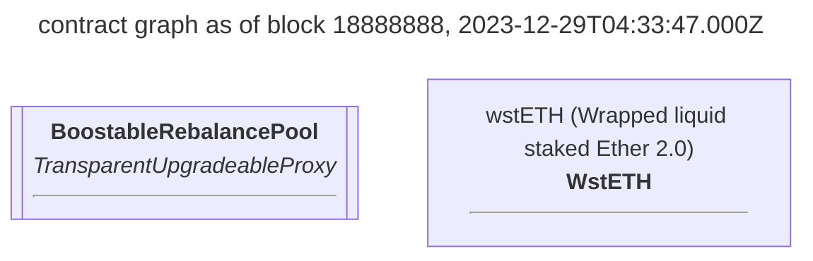

```mermaid
---
title: contract graph as of block 18888888, 2023-12-29T04:33:47.000Z
---
%%{init: {"flowchart": {"defaultRenderer": "default"}} }%%
flowchart TB

0xc6dEe5913e010895F3702bc43a40d661B13a40BD[["<b>BoostableRebalancePool</b><br><i>TransparentUpgradeableProxy</i><br><hr>"]]:::contract
click 0xc6dEe5913e010895F3702bc43a40d661B13a40BD "https://etherscan.io/address/0xc6dEe5913e010895F3702bc43a40d661B13a40BD#code"

0x7f39C581F595B53c5cb19bD0b3f8dA6c935E2Ca0["wstETH (Wrapped liquid staked Ether 2.0)<br><b>WstETH</b><br><hr>"]:::contract
click 0x7f39C581F595B53c5cb19bD0b3f8dA6c935E2Ca0 "https://etherscan.io/address/0x7f39C581F595B53c5cb19bD0b3f8dA6c935E2Ca0#code"

```
