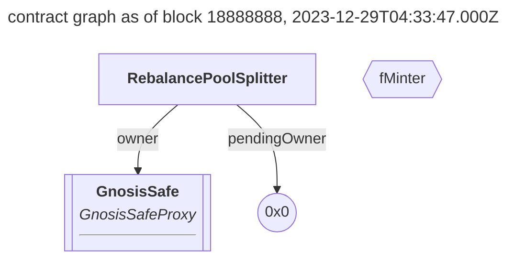

```mermaid
---
title: contract graph as of block 18888888, 2023-12-29T04:33:47.000Z
---
%%{init: {"flowchart": {"defaultRenderer": "default"}} }%%
flowchart TB

0x79c5f5b0753acE25ecdBdA4c2Bc86Ab074B6c2Bb["<b>RebalancePoolSplitter</b>"]:::contract
click 0x79c5f5b0753acE25ecdBdA4c2Bc86Ab074B6c2Bb "https://etherscan.io/address/0x79c5f5b0753acE25ecdBdA4c2Bc86Ab074B6c2Bb#code"

0x79c5f5b0753acE25ecdBdA4c2Bc86Ab074B6c2Bb -- owner --> 0x26B2ec4E02ebe2F54583af25b647b1D619e67BbF

0x79c5f5b0753acE25ecdBdA4c2Bc86Ab074B6c2Bb-pendingOwner0x0((0x0))
0x79c5f5b0753acE25ecdBdA4c2Bc86Ab074B6c2Bb -- pendingOwner --> 0x79c5f5b0753acE25ecdBdA4c2Bc86Ab074B6c2Bb-pendingOwner0x0

0x26B2ec4E02ebe2F54583af25b647b1D619e67BbF[["<b>GnosisSafe</b><br><i>GnosisSafeProxy</i><br><hr>"]]:::contract
click 0x26B2ec4E02ebe2F54583af25b647b1D619e67BbF "https://etherscan.io/address/0x26B2ec4E02ebe2F54583af25b647b1D619e67BbF#code"

0x70997970C51812dc3A010C7d01b50e0d17dc79C8{{"fMinter"}}:::address

```
