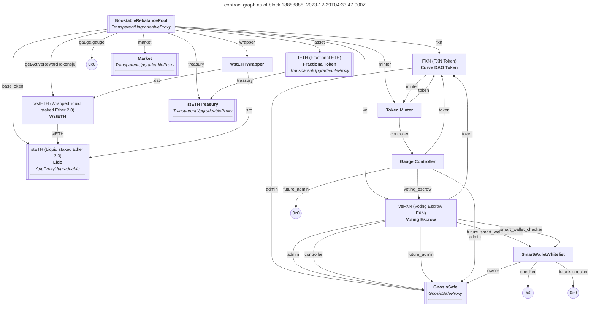

```mermaid
---
title: contract graph as of block 18888888, 2023-12-29T04:33:47.000Z
---
%%{init: {"flowchart": {"defaultRenderer": "default"}} }%%
flowchart TB

0xc6dEe5913e010895F3702bc43a40d661B13a40BD[["<b>BoostableRebalancePool</b><br><i>TransparentUpgradeableProxy</i>"]]:::contract
click 0xc6dEe5913e010895F3702bc43a40d661B13a40BD "https://etherscan.io/address/0xc6dEe5913e010895F3702bc43a40d661B13a40BD#code"

0xc6dEe5913e010895F3702bc43a40d661B13a40BD -- asset --> 0x53805A76E1f5ebbFE7115F16f9c87C2f7e633726

0xc6dEe5913e010895F3702bc43a40d661B13a40BD -- baseToken --> 0xae7ab96520DE3A18E5e111B5EaAb095312D7fE84

0xc6dEe5913e010895F3702bc43a40d661B13a40BD -- fxn --> 0x365AccFCa291e7D3914637ABf1F7635dB165Bb09

0xc6dEe5913e010895F3702bc43a40d661B13a40BD-gauge.gauge0x0((0x0))
0xc6dEe5913e010895F3702bc43a40d661B13a40BD -- gauge.gauge --> 0xc6dEe5913e010895F3702bc43a40d661B13a40BD-gauge.gauge0x0

0xc6dEe5913e010895F3702bc43a40d661B13a40BD -- getActiveRewardTokens[0] --> 0x7f39C581F595B53c5cb19bD0b3f8dA6c935E2Ca0

0xc6dEe5913e010895F3702bc43a40d661B13a40BD -- market --> 0xe7b9c7c9cA85340b8c06fb805f7775e3015108dB

0xc6dEe5913e010895F3702bc43a40d661B13a40BD -- minter --> 0xC8b194925D55d5dE9555AD1db74c149329F71DeF

0xc6dEe5913e010895F3702bc43a40d661B13a40BD -- treasury --> 0x0e5CAA5c889Bdf053c9A76395f62267E653AFbb0

0xc6dEe5913e010895F3702bc43a40d661B13a40BD -- ve --> 0xEC6B8A3F3605B083F7044C0F31f2cac0caf1d469

0xc6dEe5913e010895F3702bc43a40d661B13a40BD -- wrapper --> 0xb09e34dD25d5E88a1E9Ff6F6418109927675B658

0x53805A76E1f5ebbFE7115F16f9c87C2f7e633726[["fETH (Fractional ETH)<br><b>FractionalToken</b><br><i>TransparentUpgradeableProxy</i>"]]:::contract
click 0x53805A76E1f5ebbFE7115F16f9c87C2f7e633726 "https://etherscan.io/address/0x53805A76E1f5ebbFE7115F16f9c87C2f7e633726#code"

0x53805A76E1f5ebbFE7115F16f9c87C2f7e633726 -- treasury --> 0x0e5CAA5c889Bdf053c9A76395f62267E653AFbb0

0xae7ab96520DE3A18E5e111B5EaAb095312D7fE84[["stETH (Liquid staked Ether 2.0)<br><b>Lido</b><br><i>AppProxyUpgradeable</i><br><hr>"]]:::contract
click 0xae7ab96520DE3A18E5e111B5EaAb095312D7fE84 "https://etherscan.io/address/0xae7ab96520DE3A18E5e111B5EaAb095312D7fE84#code"

0x365AccFCa291e7D3914637ABf1F7635dB165Bb09["FXN (FXN Token)<br><b>Curve DAO Token</b>"]:::contract
click 0x365AccFCa291e7D3914637ABf1F7635dB165Bb09 "https://etherscan.io/address/0x365AccFCa291e7D3914637ABf1F7635dB165Bb09#code"

0x365AccFCa291e7D3914637ABf1F7635dB165Bb09 -- admin --> 0x26B2ec4E02ebe2F54583af25b647b1D619e67BbF

0x365AccFCa291e7D3914637ABf1F7635dB165Bb09 -- minter --> 0xC8b194925D55d5dE9555AD1db74c149329F71DeF

0x7f39C581F595B53c5cb19bD0b3f8dA6c935E2Ca0["wstETH (Wrapped liquid staked Ether 2.0)<br><b>WstETH</b>"]:::contract
click 0x7f39C581F595B53c5cb19bD0b3f8dA6c935E2Ca0 "https://etherscan.io/address/0x7f39C581F595B53c5cb19bD0b3f8dA6c935E2Ca0#code"

0x7f39C581F595B53c5cb19bD0b3f8dA6c935E2Ca0 -- stETH --> 0xae7ab96520DE3A18E5e111B5EaAb095312D7fE84

0xe7b9c7c9cA85340b8c06fb805f7775e3015108dB[["<b>Market</b><br><i>TransparentUpgradeableProxy</i><br><hr>"]]:::contract
click 0xe7b9c7c9cA85340b8c06fb805f7775e3015108dB "https://etherscan.io/address/0xe7b9c7c9cA85340b8c06fb805f7775e3015108dB#code"

0xC8b194925D55d5dE9555AD1db74c149329F71DeF["<b>Token Minter</b>"]:::contract
click 0xC8b194925D55d5dE9555AD1db74c149329F71DeF "https://etherscan.io/address/0xC8b194925D55d5dE9555AD1db74c149329F71DeF#code"

0xC8b194925D55d5dE9555AD1db74c149329F71DeF -- controller --> 0xe60eB8098B34eD775ac44B1ddE864e098C6d7f37

0xC8b194925D55d5dE9555AD1db74c149329F71DeF -- token --> 0x365AccFCa291e7D3914637ABf1F7635dB165Bb09

0x0e5CAA5c889Bdf053c9A76395f62267E653AFbb0[["<b>stETHTreasury</b><br><i>TransparentUpgradeableProxy</i><br><hr>"]]:::contract
click 0x0e5CAA5c889Bdf053c9A76395f62267E653AFbb0 "https://etherscan.io/address/0x0e5CAA5c889Bdf053c9A76395f62267E653AFbb0#code"

0xEC6B8A3F3605B083F7044C0F31f2cac0caf1d469["veFXN (Voting Escrow FXN)<br><b>Voting Escrow</b>"]:::contract
click 0xEC6B8A3F3605B083F7044C0F31f2cac0caf1d469 "https://etherscan.io/address/0xEC6B8A3F3605B083F7044C0F31f2cac0caf1d469#code"

0xEC6B8A3F3605B083F7044C0F31f2cac0caf1d469 -- admin --> 0x26B2ec4E02ebe2F54583af25b647b1D619e67BbF

0xEC6B8A3F3605B083F7044C0F31f2cac0caf1d469 -- controller --> 0x26B2ec4E02ebe2F54583af25b647b1D619e67BbF

0xEC6B8A3F3605B083F7044C0F31f2cac0caf1d469 -- future_admin --> 0x26B2ec4E02ebe2F54583af25b647b1D619e67BbF

0xEC6B8A3F3605B083F7044C0F31f2cac0caf1d469 -- future_smart_wallet_checker --> 0xD71B8B76015F296E53D41e8288a8a13eAfFff2ea

0xEC6B8A3F3605B083F7044C0F31f2cac0caf1d469 -- smart_wallet_checker --> 0xD71B8B76015F296E53D41e8288a8a13eAfFff2ea

0xEC6B8A3F3605B083F7044C0F31f2cac0caf1d469 -- token --> 0x365AccFCa291e7D3914637ABf1F7635dB165Bb09

0xb09e34dD25d5E88a1E9Ff6F6418109927675B658["<b>wstETHWrapper</b>"]:::contract
click 0xb09e34dD25d5E88a1E9Ff6F6418109927675B658 "https://etherscan.io/address/0xb09e34dD25d5E88a1E9Ff6F6418109927675B658#code"

0xb09e34dD25d5E88a1E9Ff6F6418109927675B658 -- dst --> 0x7f39C581F595B53c5cb19bD0b3f8dA6c935E2Ca0

0xb09e34dD25d5E88a1E9Ff6F6418109927675B658 -- src --> 0xae7ab96520DE3A18E5e111B5EaAb095312D7fE84

0x26B2ec4E02ebe2F54583af25b647b1D619e67BbF[["<b>GnosisSafe</b><br><i>GnosisSafeProxy</i><br><hr>"]]:::contract
click 0x26B2ec4E02ebe2F54583af25b647b1D619e67BbF "https://etherscan.io/address/0x26B2ec4E02ebe2F54583af25b647b1D619e67BbF#code"

0xe60eB8098B34eD775ac44B1ddE864e098C6d7f37["<b>Gauge Controller</b>"]:::contract
click 0xe60eB8098B34eD775ac44B1ddE864e098C6d7f37 "https://etherscan.io/address/0xe60eB8098B34eD775ac44B1ddE864e098C6d7f37#code"

0xe60eB8098B34eD775ac44B1ddE864e098C6d7f37 -- admin --> 0x26B2ec4E02ebe2F54583af25b647b1D619e67BbF

0xe60eB8098B34eD775ac44B1ddE864e098C6d7f37-future_admin0x0((0x0))
0xe60eB8098B34eD775ac44B1ddE864e098C6d7f37 -- future_admin --> 0xe60eB8098B34eD775ac44B1ddE864e098C6d7f37-future_admin0x0

0xe60eB8098B34eD775ac44B1ddE864e098C6d7f37 -- token --> 0x365AccFCa291e7D3914637ABf1F7635dB165Bb09

0xe60eB8098B34eD775ac44B1ddE864e098C6d7f37 -- voting_escrow --> 0xEC6B8A3F3605B083F7044C0F31f2cac0caf1d469

0xD71B8B76015F296E53D41e8288a8a13eAfFff2ea["<b>SmartWalletWhitelist</b>"]:::contract
click 0xD71B8B76015F296E53D41e8288a8a13eAfFff2ea "https://etherscan.io/address/0xD71B8B76015F296E53D41e8288a8a13eAfFff2ea#code"

0xD71B8B76015F296E53D41e8288a8a13eAfFff2ea-checker0x0((0x0))
0xD71B8B76015F296E53D41e8288a8a13eAfFff2ea -- checker --> 0xD71B8B76015F296E53D41e8288a8a13eAfFff2ea-checker0x0

0xD71B8B76015F296E53D41e8288a8a13eAfFff2ea-future_checker0x0((0x0))
0xD71B8B76015F296E53D41e8288a8a13eAfFff2ea -- future_checker --> 0xD71B8B76015F296E53D41e8288a8a13eAfFff2ea-future_checker0x0

0xD71B8B76015F296E53D41e8288a8a13eAfFff2ea -- owner --> 0x26B2ec4E02ebe2F54583af25b647b1D619e67BbF

```
