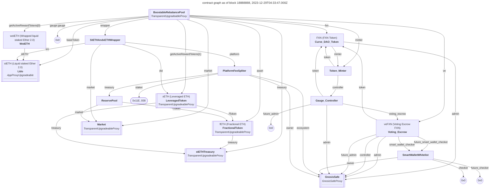

```mermaid
---
title: contract graph as of block 18888888, 2023-12-29T04:33:47.000Z
---
%%{init: {"flowchart": {"defaultRenderer": "default"}} }%%
flowchart TB

0xB87A8332dFb1C76Bb22477dCfEdDeB69865cA9f9[["<b>BoostableRebalancePool</b><br><i>TransparentUpgradeableProxy</i>"]]:::contract
click 0xB87A8332dFb1C76Bb22477dCfEdDeB69865cA9f9 "https://etherscan.io/address/0xB87A8332dFb1C76Bb22477dCfEdDeB69865cA9f9#code"

0xB87A8332dFb1C76Bb22477dCfEdDeB69865cA9f9 -- asset --> 0x53805A76E1f5ebbFE7115F16f9c87C2f7e633726

0xB87A8332dFb1C76Bb22477dCfEdDeB69865cA9f9 -- baseToken --> 0xae7ab96520DE3A18E5e111B5EaAb095312D7fE84

0xB87A8332dFb1C76Bb22477dCfEdDeB69865cA9f9 -- fxn --> 0x365AccFCa291e7D3914637ABf1F7635dB165Bb09

0xB87A8332dFb1C76Bb22477dCfEdDeB69865cA9f9-gauge.gauge0x0((0x0))
0xB87A8332dFb1C76Bb22477dCfEdDeB69865cA9f9 -- gauge.gauge --> 0xB87A8332dFb1C76Bb22477dCfEdDeB69865cA9f9-gauge.gauge0x0

0xB87A8332dFb1C76Bb22477dCfEdDeB69865cA9f9 -- getActiveRewardTokens[0] --> 0x7f39C581F595B53c5cb19bD0b3f8dA6c935E2Ca0

0xB87A8332dFb1C76Bb22477dCfEdDeB69865cA9f9 -- getActiveRewardTokens[1] --> 0xe063F04f280c60aECa68b38341C2eEcBeC703ae2

0xB87A8332dFb1C76Bb22477dCfEdDeB69865cA9f9 -- market --> 0xe7b9c7c9cA85340b8c06fb805f7775e3015108dB

0xB87A8332dFb1C76Bb22477dCfEdDeB69865cA9f9 -- minter --> 0xC8b194925D55d5dE9555AD1db74c149329F71DeF

0xB87A8332dFb1C76Bb22477dCfEdDeB69865cA9f9 -- treasury --> 0x0e5CAA5c889Bdf053c9A76395f62267E653AFbb0

0xB87A8332dFb1C76Bb22477dCfEdDeB69865cA9f9 -- ve --> 0xEC6B8A3F3605B083F7044C0F31f2cac0caf1d469

0xB87A8332dFb1C76Bb22477dCfEdDeB69865cA9f9 -- wrapper --> 0xC2BdBF323304eaBd9260b42E4d0d429Ca3481d6E

0x53805A76E1f5ebbFE7115F16f9c87C2f7e633726[["fETH (Fractional ETH)<br><b>FractionalToken</b><br><i>TransparentUpgradeableProxy</i>"]]:::contract
click 0x53805A76E1f5ebbFE7115F16f9c87C2f7e633726 "https://etherscan.io/address/0x53805A76E1f5ebbFE7115F16f9c87C2f7e633726#code"

0x53805A76E1f5ebbFE7115F16f9c87C2f7e633726 -- treasury --> 0x0e5CAA5c889Bdf053c9A76395f62267E653AFbb0

0xae7ab96520DE3A18E5e111B5EaAb095312D7fE84[["stETH (Liquid staked Ether 2.0)<br><b>Lido</b><br><i>AppProxyUpgradeable</i><br><hr>"]]:::contract
click 0xae7ab96520DE3A18E5e111B5EaAb095312D7fE84 "https://etherscan.io/address/0xae7ab96520DE3A18E5e111B5EaAb095312D7fE84#code"

0x365AccFCa291e7D3914637ABf1F7635dB165Bb09["FXN (FXN Token)<br><b>Curve_DAO_Token</b>"]:::contract
click 0x365AccFCa291e7D3914637ABf1F7635dB165Bb09 "https://etherscan.io/address/0x365AccFCa291e7D3914637ABf1F7635dB165Bb09#code"

0x365AccFCa291e7D3914637ABf1F7635dB165Bb09 -- admin --> 0x26B2ec4E02ebe2F54583af25b647b1D619e67BbF

0x365AccFCa291e7D3914637ABf1F7635dB165Bb09 -- minter --> 0xC8b194925D55d5dE9555AD1db74c149329F71DeF

0x7f39C581F595B53c5cb19bD0b3f8dA6c935E2Ca0["wstETH (Wrapped liquid staked Ether 2.0)<br><b>WstETH</b>"]:::contract
click 0x7f39C581F595B53c5cb19bD0b3f8dA6c935E2Ca0 "https://etherscan.io/address/0x7f39C581F595B53c5cb19bD0b3f8dA6c935E2Ca0#code"

0x7f39C581F595B53c5cb19bD0b3f8dA6c935E2Ca0 -- stETH --> 0xae7ab96520DE3A18E5e111B5EaAb095312D7fE84

0xe063F04f280c60aECa68b38341C2eEcBeC703ae2[["xETH (Leveraged ETH)<br><b>LeveragedToken</b><br><i>TransparentUpgradeableProxy</i>"]]:::contract
click 0xe063F04f280c60aECa68b38341C2eEcBeC703ae2 "https://etherscan.io/address/0xe063F04f280c60aECa68b38341C2eEcBeC703ae2#code"

0xe063F04f280c60aECa68b38341C2eEcBeC703ae2 -- fToken --> 0x53805A76E1f5ebbFE7115F16f9c87C2f7e633726

0xe063F04f280c60aECa68b38341C2eEcBeC703ae2 -- treasury --> 0x0e5CAA5c889Bdf053c9A76395f62267E653AFbb0

0xe7b9c7c9cA85340b8c06fb805f7775e3015108dB[["<b>Market</b><br><i>TransparentUpgradeableProxy</i><br><hr>"]]:::contract
click 0xe7b9c7c9cA85340b8c06fb805f7775e3015108dB "https://etherscan.io/address/0xe7b9c7c9cA85340b8c06fb805f7775e3015108dB#code"

0xC8b194925D55d5dE9555AD1db74c149329F71DeF["<b>Token_Minter</b>"]:::contract
click 0xC8b194925D55d5dE9555AD1db74c149329F71DeF "https://etherscan.io/address/0xC8b194925D55d5dE9555AD1db74c149329F71DeF#code"

0xC8b194925D55d5dE9555AD1db74c149329F71DeF -- controller --> 0xe60eB8098B34eD775ac44B1ddE864e098C6d7f37

0xC8b194925D55d5dE9555AD1db74c149329F71DeF -- token --> 0x365AccFCa291e7D3914637ABf1F7635dB165Bb09

0x0e5CAA5c889Bdf053c9A76395f62267E653AFbb0[["<b>stETHTreasury</b><br><i>TransparentUpgradeableProxy</i><br><hr>"]]:::contract
click 0x0e5CAA5c889Bdf053c9A76395f62267E653AFbb0 "https://etherscan.io/address/0x0e5CAA5c889Bdf053c9A76395f62267E653AFbb0#code"

0xEC6B8A3F3605B083F7044C0F31f2cac0caf1d469["veFXN (Voting Escrow FXN)<br><b>Voting_Escrow</b>"]:::contract
click 0xEC6B8A3F3605B083F7044C0F31f2cac0caf1d469 "https://etherscan.io/address/0xEC6B8A3F3605B083F7044C0F31f2cac0caf1d469#code"

0xEC6B8A3F3605B083F7044C0F31f2cac0caf1d469 -- admin --> 0x26B2ec4E02ebe2F54583af25b647b1D619e67BbF

0xEC6B8A3F3605B083F7044C0F31f2cac0caf1d469 -- controller --> 0x26B2ec4E02ebe2F54583af25b647b1D619e67BbF

0xEC6B8A3F3605B083F7044C0F31f2cac0caf1d469 -- future_admin --> 0x26B2ec4E02ebe2F54583af25b647b1D619e67BbF

0xEC6B8A3F3605B083F7044C0F31f2cac0caf1d469 -- future_smart_wallet_checker --> 0xD71B8B76015F296E53D41e8288a8a13eAfFff2ea

0xEC6B8A3F3605B083F7044C0F31f2cac0caf1d469 -- smart_wallet_checker --> 0xD71B8B76015F296E53D41e8288a8a13eAfFff2ea

0xEC6B8A3F3605B083F7044C0F31f2cac0caf1d469 -- token --> 0x365AccFCa291e7D3914637ABf1F7635dB165Bb09

0xC2BdBF323304eaBd9260b42E4d0d429Ca3481d6E["<b>StETHAndxETHWrapper</b>"]:::contract
click 0xC2BdBF323304eaBd9260b42E4d0d429Ca3481d6E "https://etherscan.io/address/0xC2BdBF323304eaBd9260b42E4d0d429Ca3481d6E#code"

0xC2BdBF323304eaBd9260b42E4d0d429Ca3481d6E -- dst --> 0xe063F04f280c60aECa68b38341C2eEcBeC703ae2

0xC2BdBF323304eaBd9260b42E4d0d429Ca3481d6E -- market --> 0xe7b9c7c9cA85340b8c06fb805f7775e3015108dB

0xC2BdBF323304eaBd9260b42E4d0d429Ca3481d6E -- platform --> 0x0084C2e1B1823564e597Ff4848a88D61ac63D703

0xC2BdBF323304eaBd9260b42E4d0d429Ca3481d6E -- src --> 0xae7ab96520DE3A18E5e111B5EaAb095312D7fE84

0x26B2ec4E02ebe2F54583af25b647b1D619e67BbF[["<b>GnosisSafe</b><br><i>GnosisSafeProxy</i><br><hr>"]]:::contract
click 0x26B2ec4E02ebe2F54583af25b647b1D619e67BbF "https://etherscan.io/address/0x26B2ec4E02ebe2F54583af25b647b1D619e67BbF#code"

0xe60eB8098B34eD775ac44B1ddE864e098C6d7f37["<b>Gauge_Controller</b>"]:::contract
click 0xe60eB8098B34eD775ac44B1ddE864e098C6d7f37 "https://etherscan.io/address/0xe60eB8098B34eD775ac44B1ddE864e098C6d7f37#code"

0xe60eB8098B34eD775ac44B1ddE864e098C6d7f37 -- admin --> 0x26B2ec4E02ebe2F54583af25b647b1D619e67BbF

0xe60eB8098B34eD775ac44B1ddE864e098C6d7f37-future_admin0x0((0x0))
0xe60eB8098B34eD775ac44B1ddE864e098C6d7f37 -- future_admin --> 0xe60eB8098B34eD775ac44B1ddE864e098C6d7f37-future_admin0x0

0xe60eB8098B34eD775ac44B1ddE864e098C6d7f37 -- token --> 0x365AccFCa291e7D3914637ABf1F7635dB165Bb09

0xe60eB8098B34eD775ac44B1ddE864e098C6d7f37 -- voting_escrow --> 0xEC6B8A3F3605B083F7044C0F31f2cac0caf1d469

0xD71B8B76015F296E53D41e8288a8a13eAfFff2ea["<b>SmartWalletWhitelist</b>"]:::contract
click 0xD71B8B76015F296E53D41e8288a8a13eAfFff2ea "https://etherscan.io/address/0xD71B8B76015F296E53D41e8288a8a13eAfFff2ea#code"

0xD71B8B76015F296E53D41e8288a8a13eAfFff2ea-checker0x0((0x0))
0xD71B8B76015F296E53D41e8288a8a13eAfFff2ea -- checker --> 0xD71B8B76015F296E53D41e8288a8a13eAfFff2ea-checker0x0

0xD71B8B76015F296E53D41e8288a8a13eAfFff2ea-future_checker0x0((0x0))
0xD71B8B76015F296E53D41e8288a8a13eAfFff2ea -- future_checker --> 0xD71B8B76015F296E53D41e8288a8a13eAfFff2ea-future_checker0x0

0xD71B8B76015F296E53D41e8288a8a13eAfFff2ea -- owner --> 0x26B2ec4E02ebe2F54583af25b647b1D619e67BbF

0x0084C2e1B1823564e597Ff4848a88D61ac63D703["<b>PlatformFeeSpliter</b>"]:::contract
click 0x0084C2e1B1823564e597Ff4848a88D61ac63D703 "https://etherscan.io/address/0x0084C2e1B1823564e597Ff4848a88D61ac63D703#code"

0x0084C2e1B1823564e597Ff4848a88D61ac63D703 -- ecosystem --> 0x26B2ec4E02ebe2F54583af25b647b1D619e67BbF

0x0084C2e1B1823564e597Ff4848a88D61ac63D703 -- owner --> 0x26B2ec4E02ebe2F54583af25b647b1D619e67BbF

0x0084C2e1B1823564e597Ff4848a88D61ac63D703 -- staker --> 0x11E91BB6d1334585AA37D8F4fde3932C7960B938

0x0084C2e1B1823564e597Ff4848a88D61ac63D703 -- treasury --> 0x5d0Aacf75116d1645Db2B3d1Ca4b303ef0CA3752

0x11E91BB6d1334585AA37D8F4fde3932C7960B938(["0x11E..938"]):::address
click 0x11E91BB6d1334585AA37D8F4fde3932C7960B938 "https://etherscan.io/address/0x11E91BB6d1334585AA37D8F4fde3932C7960B938"

0x5d0Aacf75116d1645Db2B3d1Ca4b303ef0CA3752["<b>ReservePool</b>"]:::contract
click 0x5d0Aacf75116d1645Db2B3d1Ca4b303ef0CA3752 "https://etherscan.io/address/0x5d0Aacf75116d1645Db2B3d1Ca4b303ef0CA3752#code"

0x5d0Aacf75116d1645Db2B3d1Ca4b303ef0CA3752 -- fToken --> 0x53805A76E1f5ebbFE7115F16f9c87C2f7e633726

0x5d0Aacf75116d1645Db2B3d1Ca4b303ef0CA3752 -- market --> 0xe7b9c7c9cA85340b8c06fb805f7775e3015108dB

```
