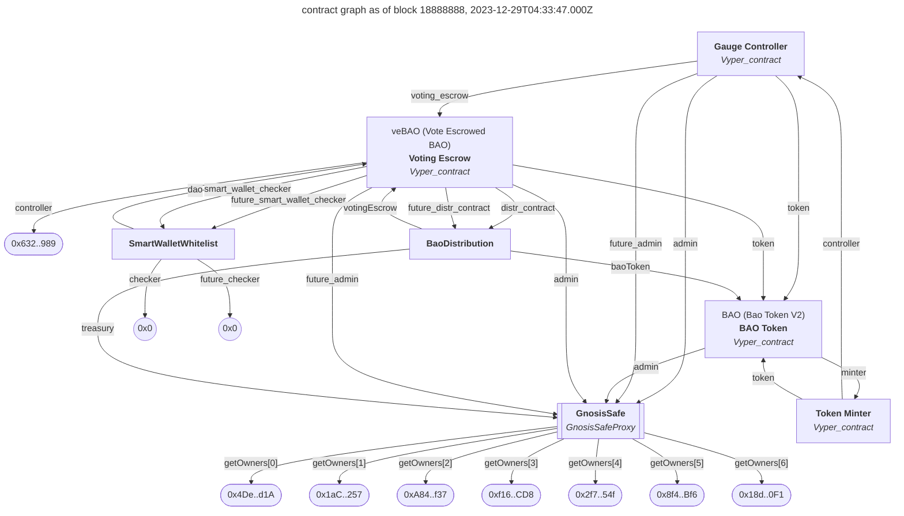

```mermaid
---
title: contract graph as of block 18888888, 2023-12-29T04:33:47.000Z
---
%%{init: {"flowchart": {"defaultRenderer": "default"}} }%%
flowchart TB

0x840e75261c2934f33C8766F6eA6235330DC1D72d["<b>Gauge Controller</b><br><i>Vyper_contract</i>"]:::contract
click 0x840e75261c2934f33C8766F6eA6235330DC1D72d "https://etherscan.io/address/0x840e75261c2934f33C8766F6eA6235330DC1D72d#code"

0x840e75261c2934f33C8766F6eA6235330DC1D72d -- admin --> 0x3dFc49e5112005179Da613BdE5973229082dAc35

0x840e75261c2934f33C8766F6eA6235330DC1D72d -- future_admin --> 0x3dFc49e5112005179Da613BdE5973229082dAc35

0x840e75261c2934f33C8766F6eA6235330DC1D72d -- token --> 0xCe391315b414D4c7555956120461D21808A69F3A

0x840e75261c2934f33C8766F6eA6235330DC1D72d -- voting_escrow --> 0x8Bf70DFE40F07a5ab715F7e888478d9D3680a2B6

0x3dFc49e5112005179Da613BdE5973229082dAc35[["<b>GnosisSafe</b><br><i>GnosisSafeProxy</i>"]]:::contract
click 0x3dFc49e5112005179Da613BdE5973229082dAc35 "https://etherscan.io/address/0x3dFc49e5112005179Da613BdE5973229082dAc35#code"

0x3dFc49e5112005179Da613BdE5973229082dAc35 -- getOwners[0] --> 0x4De2494a282B295B08E84dDd0926749fe9964d1A

0x3dFc49e5112005179Da613BdE5973229082dAc35 -- getOwners[1] --> 0x1aCA782843444905712a4929C75F6575a32FA257

0x3dFc49e5112005179Da613BdE5973229082dAc35 -- getOwners[2] --> 0xA849456125301De7DedA49c09a65B673C115Cf37

0x3dFc49e5112005179Da613BdE5973229082dAc35 -- getOwners[3] --> 0xf1674FE69b2920b4de51E909cbf060dd78724CD8

0x3dFc49e5112005179Da613BdE5973229082dAc35 -- getOwners[4] --> 0x2f75E925C38f83785A7D0630f65Aed8C65C1454f

0x3dFc49e5112005179Da613BdE5973229082dAc35 -- getOwners[5] --> 0x8f4A7b7AeaA5c0E01b7b3c0e966D8E62e7b3cBf6

0x3dFc49e5112005179Da613BdE5973229082dAc35 -- getOwners[6] --> 0x18d5D444467Fa53a78e72cB98375F57efDAfF0F1

0xCe391315b414D4c7555956120461D21808A69F3A["BAO (Bao Token V2)<br><b>BAO Token</b><br><i>Vyper_contract</i>"]:::contract
click 0xCe391315b414D4c7555956120461D21808A69F3A "https://etherscan.io/address/0xCe391315b414D4c7555956120461D21808A69F3A#code"

0xCe391315b414D4c7555956120461D21808A69F3A -- admin --> 0x3dFc49e5112005179Da613BdE5973229082dAc35

0xCe391315b414D4c7555956120461D21808A69F3A -- minter --> 0x7492Aa25Dcb4013925c199Ded466Fdf9baa6A380

0x8Bf70DFE40F07a5ab715F7e888478d9D3680a2B6["veBAO (Vote Escrowed BAO)<br><b>Voting Escrow</b><br><i>Vyper_contract</i>"]:::contract
click 0x8Bf70DFE40F07a5ab715F7e888478d9D3680a2B6 "https://etherscan.io/address/0x8Bf70DFE40F07a5ab715F7e888478d9D3680a2B6#code"

0x8Bf70DFE40F07a5ab715F7e888478d9D3680a2B6 -- admin --> 0x3dFc49e5112005179Da613BdE5973229082dAc35

0x8Bf70DFE40F07a5ab715F7e888478d9D3680a2B6 -- controller --> 0x632e6920B7c443D92052442e0F230355099a9989

0x8Bf70DFE40F07a5ab715F7e888478d9D3680a2B6 -- distr_contract --> 0x885D90A424f87D362C9369C0F3d9A2d28AF495F4

0x8Bf70DFE40F07a5ab715F7e888478d9D3680a2B6 -- future_admin --> 0x3dFc49e5112005179Da613BdE5973229082dAc35

0x8Bf70DFE40F07a5ab715F7e888478d9D3680a2B6 -- future_distr_contract --> 0x885D90A424f87D362C9369C0F3d9A2d28AF495F4

0x8Bf70DFE40F07a5ab715F7e888478d9D3680a2B6 -- future_smart_wallet_checker --> 0x1390c3ffb3f45864641f08bcc66211935B10D753

0x8Bf70DFE40F07a5ab715F7e888478d9D3680a2B6 -- smart_wallet_checker --> 0x1390c3ffb3f45864641f08bcc66211935B10D753

0x8Bf70DFE40F07a5ab715F7e888478d9D3680a2B6 -- token --> 0xCe391315b414D4c7555956120461D21808A69F3A

0x4De2494a282B295B08E84dDd0926749fe9964d1A(["0x4De..d1A"]):::address
click 0x4De2494a282B295B08E84dDd0926749fe9964d1A "https://etherscan.io/address/0x4De2494a282B295B08E84dDd0926749fe9964d1A"

0x1aCA782843444905712a4929C75F6575a32FA257(["0x1aC..257"]):::address
click 0x1aCA782843444905712a4929C75F6575a32FA257 "https://etherscan.io/address/0x1aCA782843444905712a4929C75F6575a32FA257"

0xA849456125301De7DedA49c09a65B673C115Cf37(["0xA84..f37"]):::address
click 0xA849456125301De7DedA49c09a65B673C115Cf37 "https://etherscan.io/address/0xA849456125301De7DedA49c09a65B673C115Cf37"

0xf1674FE69b2920b4de51E909cbf060dd78724CD8(["0xf16..CD8"]):::address
click 0xf1674FE69b2920b4de51E909cbf060dd78724CD8 "https://etherscan.io/address/0xf1674FE69b2920b4de51E909cbf060dd78724CD8"

0x2f75E925C38f83785A7D0630f65Aed8C65C1454f(["0x2f7..54f"]):::address
click 0x2f75E925C38f83785A7D0630f65Aed8C65C1454f "https://etherscan.io/address/0x2f75E925C38f83785A7D0630f65Aed8C65C1454f"

0x8f4A7b7AeaA5c0E01b7b3c0e966D8E62e7b3cBf6(["0x8f4..Bf6"]):::address
click 0x8f4A7b7AeaA5c0E01b7b3c0e966D8E62e7b3cBf6 "https://etherscan.io/address/0x8f4A7b7AeaA5c0E01b7b3c0e966D8E62e7b3cBf6"

0x18d5D444467Fa53a78e72cB98375F57efDAfF0F1(["0x18d..0F1"]):::address
click 0x18d5D444467Fa53a78e72cB98375F57efDAfF0F1 "https://etherscan.io/address/0x18d5D444467Fa53a78e72cB98375F57efDAfF0F1"

0x7492Aa25Dcb4013925c199Ded466Fdf9baa6A380["<b>Token Minter</b><br><i>Vyper_contract</i>"]:::contract
click 0x7492Aa25Dcb4013925c199Ded466Fdf9baa6A380 "https://etherscan.io/address/0x7492Aa25Dcb4013925c199Ded466Fdf9baa6A380#code"

0x7492Aa25Dcb4013925c199Ded466Fdf9baa6A380 -- controller --> 0x840e75261c2934f33C8766F6eA6235330DC1D72d

0x7492Aa25Dcb4013925c199Ded466Fdf9baa6A380 -- token --> 0xCe391315b414D4c7555956120461D21808A69F3A

0x632e6920B7c443D92052442e0F230355099a9989(["0x632..989"]):::address
click 0x632e6920B7c443D92052442e0F230355099a9989 "https://etherscan.io/address/0x632e6920B7c443D92052442e0F230355099a9989"

0x885D90A424f87D362C9369C0F3d9A2d28AF495F4["<b>BaoDistribution</b>"]:::contract
click 0x885D90A424f87D362C9369C0F3d9A2d28AF495F4 "https://etherscan.io/address/0x885D90A424f87D362C9369C0F3d9A2d28AF495F4#code"

0x885D90A424f87D362C9369C0F3d9A2d28AF495F4 -- baoToken --> 0xCe391315b414D4c7555956120461D21808A69F3A

0x885D90A424f87D362C9369C0F3d9A2d28AF495F4 -- treasury --> 0x3dFc49e5112005179Da613BdE5973229082dAc35

0x885D90A424f87D362C9369C0F3d9A2d28AF495F4 -- votingEscrow --> 0x8Bf70DFE40F07a5ab715F7e888478d9D3680a2B6

0x1390c3ffb3f45864641f08bcc66211935B10D753["<b>SmartWalletWhitelist</b>"]:::contract
click 0x1390c3ffb3f45864641f08bcc66211935B10D753 "https://etherscan.io/address/0x1390c3ffb3f45864641f08bcc66211935B10D753#code"

0x1390c3ffb3f45864641f08bcc66211935B10D753-checker0x0((0x0))
0x1390c3ffb3f45864641f08bcc66211935B10D753 -- checker --> 0x1390c3ffb3f45864641f08bcc66211935B10D753-checker0x0

0x1390c3ffb3f45864641f08bcc66211935B10D753 -- dao --> 0x8Bf70DFE40F07a5ab715F7e888478d9D3680a2B6

0x1390c3ffb3f45864641f08bcc66211935B10D753-future_checker0x0((0x0))
0x1390c3ffb3f45864641f08bcc66211935B10D753 -- future_checker --> 0x1390c3ffb3f45864641f08bcc66211935B10D753-future_checker0x0

```
