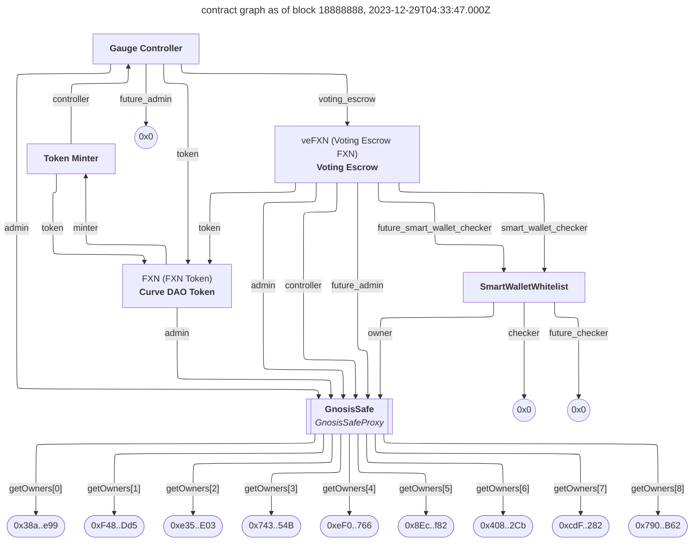

```mermaid
---
title: contract graph as of block 18888888, 2023-12-29T04:33:47.000Z
---
%%{init: {"flowchart": {"defaultRenderer": "elk"}} }%%
flowchart TB

0xC8b194925D55d5dE9555AD1db74c149329F71DeF["<b>Token Minter</b>"]:::contract
click 0xC8b194925D55d5dE9555AD1db74c149329F71DeF "https://etherscan.io/address/0xC8b194925D55d5dE9555AD1db74c149329F71DeF#code"

0xC8b194925D55d5dE9555AD1db74c149329F71DeF -- controller --> 0xe60eB8098B34eD775ac44B1ddE864e098C6d7f37

0xC8b194925D55d5dE9555AD1db74c149329F71DeF -- token --> 0x365AccFCa291e7D3914637ABf1F7635dB165Bb09

0xe60eB8098B34eD775ac44B1ddE864e098C6d7f37["<b>Gauge Controller</b>"]:::contract
click 0xe60eB8098B34eD775ac44B1ddE864e098C6d7f37 "https://etherscan.io/address/0xe60eB8098B34eD775ac44B1ddE864e098C6d7f37#code"

0xe60eB8098B34eD775ac44B1ddE864e098C6d7f37 -- admin --> 0x26B2ec4E02ebe2F54583af25b647b1D619e67BbF

0xe60eB8098B34eD775ac44B1ddE864e098C6d7f37-future_admin0x0((0x0))
0xe60eB8098B34eD775ac44B1ddE864e098C6d7f37 -- future_admin --> 0xe60eB8098B34eD775ac44B1ddE864e098C6d7f37-future_admin0x0

0xe60eB8098B34eD775ac44B1ddE864e098C6d7f37 -- token --> 0x365AccFCa291e7D3914637ABf1F7635dB165Bb09

0xe60eB8098B34eD775ac44B1ddE864e098C6d7f37 -- voting_escrow --> 0xEC6B8A3F3605B083F7044C0F31f2cac0caf1d469

0x365AccFCa291e7D3914637ABf1F7635dB165Bb09["FXN (FXN Token)<br><b>Curve DAO Token</b>"]:::contract
click 0x365AccFCa291e7D3914637ABf1F7635dB165Bb09 "https://etherscan.io/address/0x365AccFCa291e7D3914637ABf1F7635dB165Bb09#code"

0x365AccFCa291e7D3914637ABf1F7635dB165Bb09 -- admin --> 0x26B2ec4E02ebe2F54583af25b647b1D619e67BbF

0x365AccFCa291e7D3914637ABf1F7635dB165Bb09 -- minter --> 0xC8b194925D55d5dE9555AD1db74c149329F71DeF

0x26B2ec4E02ebe2F54583af25b647b1D619e67BbF[["<b>GnosisSafe</b><br><i>GnosisSafeProxy</i>"]]:::contract
click 0x26B2ec4E02ebe2F54583af25b647b1D619e67BbF "https://etherscan.io/address/0x26B2ec4E02ebe2F54583af25b647b1D619e67BbF#code"

0x26B2ec4E02ebe2F54583af25b647b1D619e67BbF -- getOwners[0] --> 0x38a93e70b0D8343657f802C1c3Fdb06aC8F8fe99

0x26B2ec4E02ebe2F54583af25b647b1D619e67BbF -- getOwners[1] --> 0xF483De0f306952FA56ef56c1dbBDd2A70737bDd5

0x26B2ec4E02ebe2F54583af25b647b1D619e67BbF -- getOwners[2] --> 0xe3522d85d37F55735e9327CD7a5cDe3abaf28E03

0x26B2ec4E02ebe2F54583af25b647b1D619e67BbF -- getOwners[3] --> 0x74390470F4001Ca85D93bD546A4Ab1724359654B

0x26B2ec4E02ebe2F54583af25b647b1D619e67BbF -- getOwners[4] --> 0xeF0Ca09fbf9a5f61E657Fb208b46b8685c1d4766

0x26B2ec4E02ebe2F54583af25b647b1D619e67BbF -- getOwners[5] --> 0x8EcAB7B8ed8215cA52500cbf1548B9239173ef82

0x26B2ec4E02ebe2F54583af25b647b1D619e67BbF -- getOwners[6] --> 0x4088421cBDBa1501d8Fd09fD241717097Afb42Cb

0x26B2ec4E02ebe2F54583af25b647b1D619e67BbF -- getOwners[7] --> 0xcdF067F306E7a511Ef701588AFCdcff292B19282

0x26B2ec4E02ebe2F54583af25b647b1D619e67BbF -- getOwners[8] --> 0x7904Ad7c992CDAb500dAa0f3366301b1f5365B62

0xEC6B8A3F3605B083F7044C0F31f2cac0caf1d469["veFXN (Voting Escrow FXN)<br><b>Voting Escrow</b>"]:::contract
click 0xEC6B8A3F3605B083F7044C0F31f2cac0caf1d469 "https://etherscan.io/address/0xEC6B8A3F3605B083F7044C0F31f2cac0caf1d469#code"

0xEC6B8A3F3605B083F7044C0F31f2cac0caf1d469 -- admin --> 0x26B2ec4E02ebe2F54583af25b647b1D619e67BbF

0xEC6B8A3F3605B083F7044C0F31f2cac0caf1d469 -- controller --> 0x26B2ec4E02ebe2F54583af25b647b1D619e67BbF

0xEC6B8A3F3605B083F7044C0F31f2cac0caf1d469 -- future_admin --> 0x26B2ec4E02ebe2F54583af25b647b1D619e67BbF

0xEC6B8A3F3605B083F7044C0F31f2cac0caf1d469 -- future_smart_wallet_checker --> 0xD71B8B76015F296E53D41e8288a8a13eAfFff2ea

0xEC6B8A3F3605B083F7044C0F31f2cac0caf1d469 -- smart_wallet_checker --> 0xD71B8B76015F296E53D41e8288a8a13eAfFff2ea

0xEC6B8A3F3605B083F7044C0F31f2cac0caf1d469 -- token --> 0x365AccFCa291e7D3914637ABf1F7635dB165Bb09

0x38a93e70b0D8343657f802C1c3Fdb06aC8F8fe99(["0x38a..e99"]):::address
click 0x38a93e70b0D8343657f802C1c3Fdb06aC8F8fe99 "https://etherscan.io/address/0x38a93e70b0D8343657f802C1c3Fdb06aC8F8fe99"

0xF483De0f306952FA56ef56c1dbBDd2A70737bDd5(["0xF48..Dd5"]):::address
click 0xF483De0f306952FA56ef56c1dbBDd2A70737bDd5 "https://etherscan.io/address/0xF483De0f306952FA56ef56c1dbBDd2A70737bDd5"

0xe3522d85d37F55735e9327CD7a5cDe3abaf28E03(["0xe35..E03"]):::address
click 0xe3522d85d37F55735e9327CD7a5cDe3abaf28E03 "https://etherscan.io/address/0xe3522d85d37F55735e9327CD7a5cDe3abaf28E03"

0x74390470F4001Ca85D93bD546A4Ab1724359654B(["0x743..54B"]):::address
click 0x74390470F4001Ca85D93bD546A4Ab1724359654B "https://etherscan.io/address/0x74390470F4001Ca85D93bD546A4Ab1724359654B"

0xeF0Ca09fbf9a5f61E657Fb208b46b8685c1d4766(["0xeF0..766"]):::address
click 0xeF0Ca09fbf9a5f61E657Fb208b46b8685c1d4766 "https://etherscan.io/address/0xeF0Ca09fbf9a5f61E657Fb208b46b8685c1d4766"

0x8EcAB7B8ed8215cA52500cbf1548B9239173ef82(["0x8Ec..f82"]):::address
click 0x8EcAB7B8ed8215cA52500cbf1548B9239173ef82 "https://etherscan.io/address/0x8EcAB7B8ed8215cA52500cbf1548B9239173ef82"

0x4088421cBDBa1501d8Fd09fD241717097Afb42Cb(["0x408..2Cb"]):::address
click 0x4088421cBDBa1501d8Fd09fD241717097Afb42Cb "https://etherscan.io/address/0x4088421cBDBa1501d8Fd09fD241717097Afb42Cb"

0xcdF067F306E7a511Ef701588AFCdcff292B19282(["0xcdF..282"]):::address
click 0xcdF067F306E7a511Ef701588AFCdcff292B19282 "https://etherscan.io/address/0xcdF067F306E7a511Ef701588AFCdcff292B19282"

0x7904Ad7c992CDAb500dAa0f3366301b1f5365B62(["0x790..B62"]):::address
click 0x7904Ad7c992CDAb500dAa0f3366301b1f5365B62 "https://etherscan.io/address/0x7904Ad7c992CDAb500dAa0f3366301b1f5365B62"

0xD71B8B76015F296E53D41e8288a8a13eAfFff2ea["<b>SmartWalletWhitelist</b>"]:::contract
click 0xD71B8B76015F296E53D41e8288a8a13eAfFff2ea "https://etherscan.io/address/0xD71B8B76015F296E53D41e8288a8a13eAfFff2ea#code"

0xD71B8B76015F296E53D41e8288a8a13eAfFff2ea-checker0x0((0x0))
0xD71B8B76015F296E53D41e8288a8a13eAfFff2ea -- checker --> 0xD71B8B76015F296E53D41e8288a8a13eAfFff2ea-checker0x0

0xD71B8B76015F296E53D41e8288a8a13eAfFff2ea-future_checker0x0((0x0))
0xD71B8B76015F296E53D41e8288a8a13eAfFff2ea -- future_checker --> 0xD71B8B76015F296E53D41e8288a8a13eAfFff2ea-future_checker0x0

0xD71B8B76015F296E53D41e8288a8a13eAfFff2ea -- owner --> 0x26B2ec4E02ebe2F54583af25b647b1D619e67BbF

```
